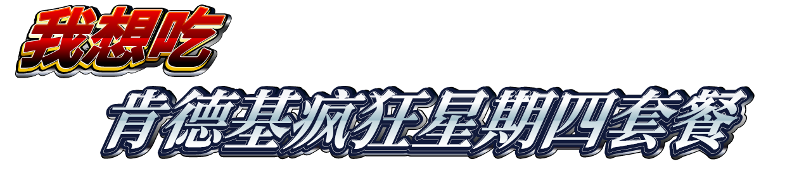
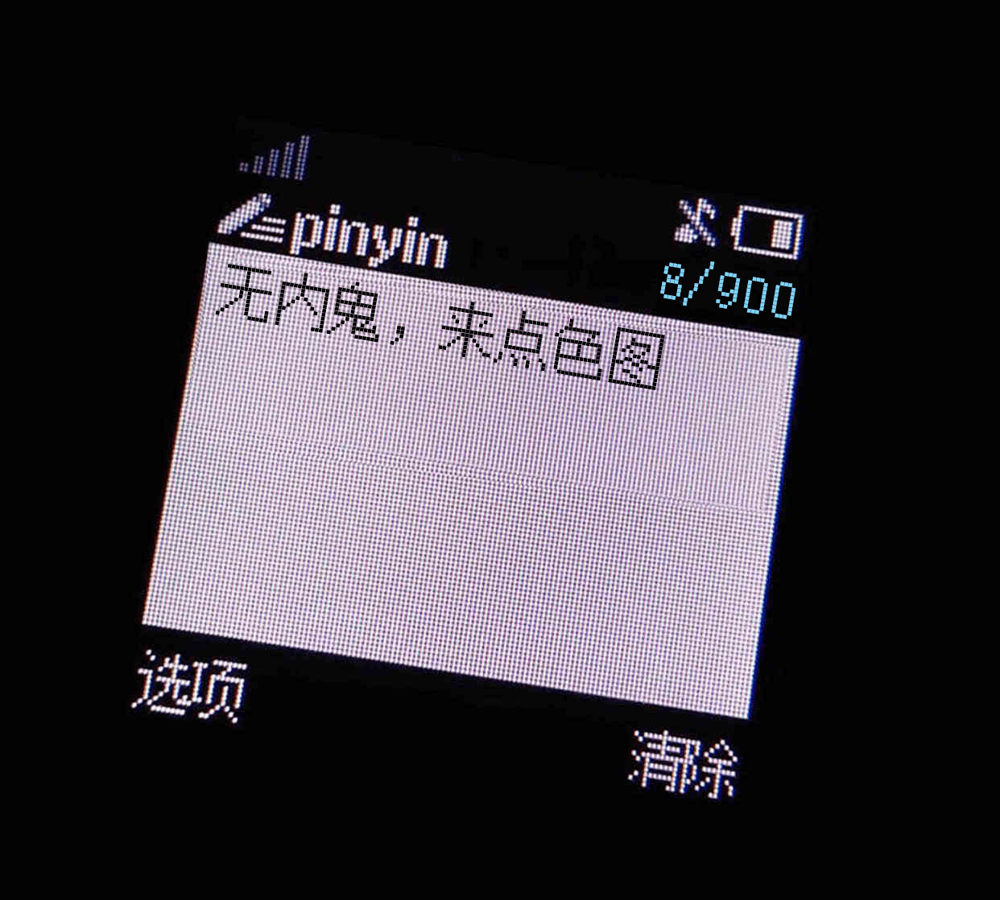
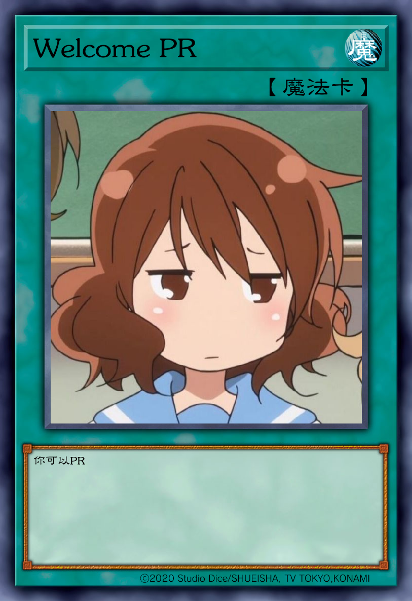
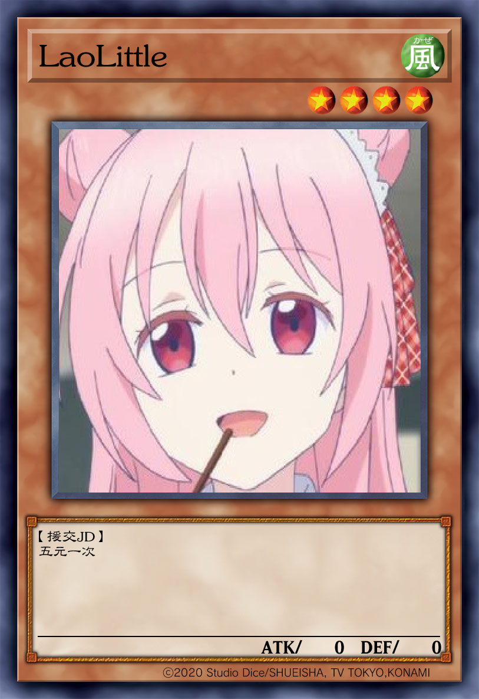

# [Meme Helper](https://github.com/cssxsh/meme-helper)

> 基于 [Mirai Console](https://github.com/mamoe/mirai-console) 的 MEME 生成插件
> 
[](https://github.com/cssxsh/meme-helper/releases)
[](https://shields.io/category/downloads)
[](https://mirai.mamoe.net/topic/334)

**使用前应该查阅的相关文档或项目**

* [User Manual](https://github.com/mamoe/mirai/blob/dev/docs/UserManual.md)
* [Permission Command](https://github.com/mamoe/mirai/blob/dev/mirai-console/docs/BuiltInCommands.md#permissioncommand)

插件依赖于 [Mirai Skia Plugin](https://github.com/cssxsh/mirai-skia-plugin) (必要)
插件依赖于 [Mirai Hibernate Plugin](https://github.com/cssxsh/mirai-hibernate-plugin) (不必要)

**目前插件开发处于实验性阶段**

## 基本功能

### PornHub 

PornHub Login 生成

示例: `#ph Git Hub`  


### PetPet

摸摸头生成

示例: `#pet @群主`, `#pet 123456`  


### Dear

狂亲表情包生成

示例: `#dear @群主`, `#dear 123456`  


### 5000choyen

5000choyen 表情包生成

示例: `#choyen 我想吃 肯德基疯狂星期四套餐`  


### zzkia

诺基亚短信 表情包生成

示例: `#pinyin 无内鬼，来点色图`  


### 游戏王

游戏王 表情包生成

示例: 
```
#spell @Him188
Welcome PR
你可以PR
```


```
#trap @Him188
Useless PR
这个还是由我们自己实现
```


```
#monster @LaoLittle

援交JD
五元一次
```


### 随机表情包

随机表情包一张（通过 Mirai Hibernate Plugin 插件 从消息中收集得到）

示例: `随机表情包`

## 配置

### regex